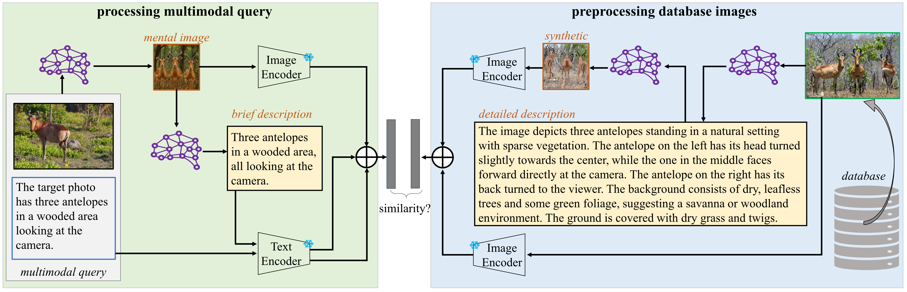
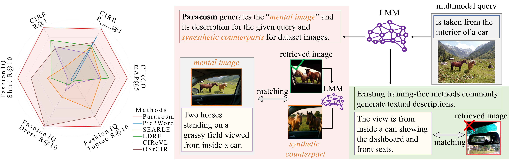

<div align='center'>
<h1>Generating a Paracosm for Training-Free Zero-Shot Composed Image Retrieval</h1>
	
<a href="https://leowangtong.github.io/" target="_blank">Tong Wang</a><sup>1</sup>,
<a href="https://yunhan-zhao.github.io/" target="_blank">Yunhan Zhao</a><sup>2</sup>,
<a href="https://aimerykong.github.io/" target="_blank">Shu Kong</a><sup>1,3</sup>

<span><sup>1</sup>University of Macau,</span>
<span><sup>2</sup>UC Irvine,</span>
<span><sup>3</sup>Institute of Collaborative Innovation</span>
 
<a href="https://arxiv.org/abs/2602.00813"></a>
<a href="https://leowangtong.github.io/Paracosm/"></a>
</div>

<!-- <div align="center">
  <h3 style="margin-bottom: 0;">
    <font color="red"><b>ECCV 2026</b></font>
  </h3>
</div> -->
<!-- <h1 align="center"><font color="red">🔥 ECCV 2026 🔥</font></h1> -->

$$ {\color{red}\Huge \text{🔥 ECCV 2026 🔥}} $$

## Overview
### Abstract
<div align="justify">

> Composed Image Retrieval (CIR) is the task of retrieving a target image from a database using a multimodal query, which consists of a reference image and a modification text. The text specifies how to alter the reference image to form a ''mental image'', based on which CIR should find the target image in the database. The fundamental  challenge of CIR is that this ''mental image'' is not physically available and is only implicitly defined by the query. The contemporary literature pursues zero-shot methods and uses a Large Multimodal Model (LMM) to generate a textual description for a given multimodal query, and then employs a Vision-Language Model (VLM) for textual-visual matching to search for the target image. In contrast, we address CIR from first principles by directly generating the ''mental image'' for more accurate matching. Particularly, we prompt an LMM to generate a ''mental image'' for a given multimodal query and propose to use this ''mental image'' to search for the target image. As the ''mental image'' has a synthetic-to-real domain gap with real images, we also generate a synthetic counterpart for each real image in the database to facilitate matching. In this sense, our method uses LMM to construct a ``paracosm'', where it matches the multimodal query and database images. Hence, we call this method Paracosm. Notably, Paracosm is a training-free zero-shot CIR method. It significantly outperforms existing zero-shot methods on challenging benchmarks, achieving state-of-the-art performance for zero-shot CIR.


> **Flowchart of our training-free zero-shot CIR method Paracosm.** Given a multimodal query that consists of a reference image and a modification text, we feed it to an LMM to generate a ''mental image''. We further generate a brief description for it. Both the ''mental image'' and description, as well as the modification text, are used as feature representations for the query. As the ''mental image'' is synthetic, we mitigate synthetic-to-real domain gaps by generating synthetic counterparts of database images. To do so, we use the LMM to generate *detailed* descriptions, which are used as prompts for image generation. For a database image, we use both itself (i.e., the real photo) and its synthetic counterpart as representation for retrieval. In sum, our method uses LMMs to create a virtual **paracosm**, where it matches the query and database images.


## News

- **2025-06-20:** Paracosm is accepted to ECCV 2026!
- **2026-02-03:** Paracosm code is released.
- **2026-01-31:** arXiv preprint is published.


## Environment Setting

Before running the demo, install the revelant packages using

```sh
conda create -n paracosm -y python=3.10
conda activate paracosm
pip install torch==2.5.1 torchvision==0.20.1 transformers==4.49.0 torchao==0.12.0 openai==2.6.0 open_clip_torch==2.26.1
pip install git+https://github.com/openai/CLIP.git
```


## Dataset Preparation 

Please follow the instructions in [DATASET.md](DATASETS.md) to prepare the datasets used in the experiments.


## Demo for Paracosm
[Paracosm_demo.ipynb](Paracosm_demo.ipynb) provides a demo implementation of the Paracosm for the processes of mental image generation, description generation, and synthetic counterpart generation. Additionally, it also presents the retrieval process of Paracosm on the CIRCO validation set. 


## Performance
<div align='center'>
    
</div>


## Acknowledgments

Our code is built on [SEARLE(ICCV'23)](https://github.com/miccunifi/SEARLE/tree/main).


## Citation

If you find our project useful, please consider citing:

```bibtex
@inproceedings{wang2026paracosm,
    title={Generating a Paracosm for Training-Free Zero-Shot Composed Image Retrieval}, 
    author={Tong Wang and Yunhan Zhao and Shu Kong},
    booktitle={European Conference on Computer Vision (ECCV)},
    year={2026}
}
```
